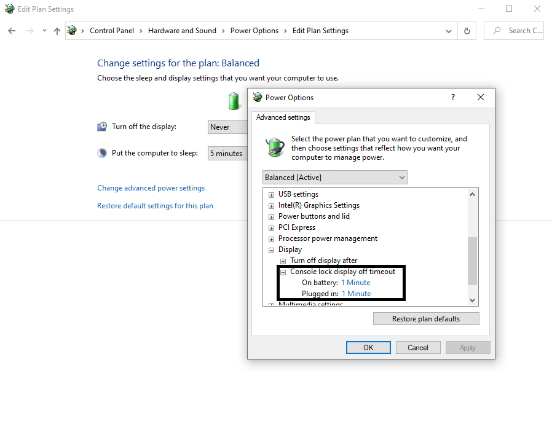
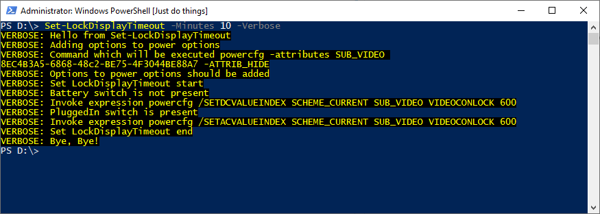

# SetLockDisplayTimeout

Module sets up the inactivity time after which lock screen will show up.

<!--more-->

**Console lock display off timeout** option is used by administrators to improve security. Unfortnuatelly very often they are setting this value to some small value like 1 minute. 

To block users to changing value option is often hidden.

Module adds option again to the interface and sets value to given one. 

<!--og-image-->


Paramters:
 - Minutes - sets amout of minutes to set up in the option

Switchers
- Battery -sets the **On battery** option
- PluggedIn - sets the **PluggetIn** option

Example of usage:

```Powershell
Set-LockDisplayTimeout -Minutes 1 -Verbose
``` 


